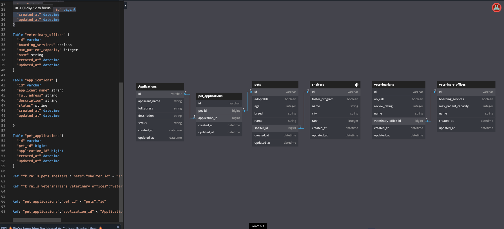

# PRESENTATION CHECKLIST

- Choose screen recording option (Huddle, Zoom, Loom?)
    - Will upload to either Google Drive or Youtube
    - Include link in Submission

Regarding Presentation Feedback
 - Questions for instructors about project?:
    - 
    - 
- Specific Desired Feedback?
    - 
    -

- Select User Stories to Present:
    - Lito:  User Story 1?
    - Tyler: User Story 3?

For each story:

- Demonstrate the user story on your deployment site (Render or Heroku, or localhost if the feature is not functional in Production)

- Describe and show how you came up with the solution to this user story, including your tests & code that makes those tests pass

- Discuss and/or show any stumbling blocks you encountered along the way, and talk about what you/your team did to solve them.

- In your presentation, please also include any questions or areas of your code where you would like to receive instructor feedback.

****************************************************************************

# Adopt, don't Shop

This is a paired project used in Turing School's Backend Program Module 2.

## Learning Goals

In this project, students will build upon the code in this repo to create a Pet Adoption Platform. Users will be able to apply to adopt pets, and Admins will be able to approve or reject applications and see statistics for the Shelters, Pets, and Applications in the system.

- Build out CRUD functionality for a many to many relationship
- Use ActiveRecord to write queries that join multiple tables of data together
- Use MVC to organize code effectively, limiting the amount of logic included in views and controllers
- Validate models and handle sad paths for invalid data input
- Use flash messages to give feedback to the user
- Use partials in views
- Use `within` blocks in tests
- Track user stories using GitHub Projects
- Deploy your application to the internet

## Requirements

- Project must use Rails 7.1.x, Ruby 3.2.2, and PostgreSQL
- Use of `resources` on this project is not permitted
- Use of scaffolding on this project is not permitted
- Students wanting to use any extra gems on this project must first get permission from your instructors
    - Pre-approved gems are `pry, simplecov, capybara, rspec-rails, shoulda-matchers, faker, factory_bot_rails, orderly, launchy`

## Project Phases

1. [Set Up](./doc/set_up.md)
1. [User Stories](./doc/user_stories.md)
1. [Evaluation](./doc/evaluation.md)

## Check In

This project will have one Check In. During your Check In, you should be prepared to review your database schema for the many to many relationship, your deployment to the internet, and your GitHub Projects board.

## DB Design

